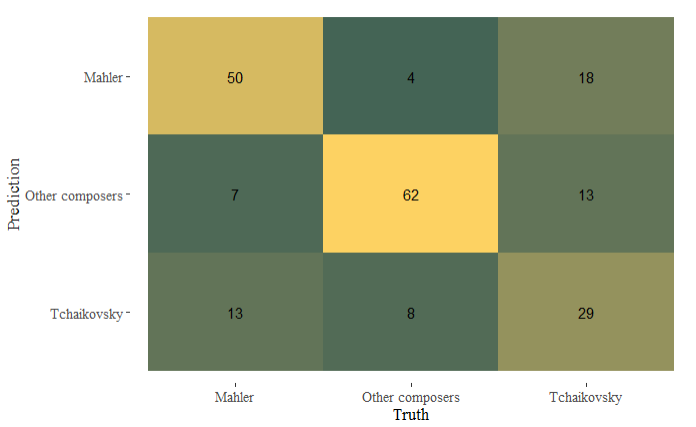

```{r include=FALSE}
library(tidyverse)
library(tidymodels)
library(spotifyr)
library(compmus)
library(formattable)
library(plotly)
library(ggdendro)
library(heatmaply)
library(recipes)
library(rsample)
library(wesanderson)

get_conf_mat <- function(fit) {
  outcome <- .get_tune_outcome_names(fit)
  fit %>% 
    collect_predictions() %>% 
    conf_mat(truth = outcome, estimate = .pred_class)
}  

get_pr <- function(fit) {
  fit %>% 
    conf_mat_resampled() %>% 
    group_by(Prediction) %>% mutate(precision = Freq / sum(Freq)) %>% 
    group_by(Truth) %>% mutate(recall = Freq / sum(Freq)) %>% 
    ungroup() %>% filter(Prediction == Truth) %>% 
    select(class = Prediction, precision, recall)
}  
```

```{r include=FALSE}
# Downloading the playlists from Spotify

tchai <- get_playlist_audio_features("", "37i9dQZF1DX2kvBlhyEkb6")
mahler <- get_playlist_audio_features("", "37i9dQZF1DWYFH7pZ5xe7h")

otherComposers <- get_playlist_audio_features("", "1h0CEZCm6IbFTbxThn6Xcs")
others <- otherComposers[-c(21, 25, 29, 33, 58, 74),]; # without Tchaikovsky and Mahler tracks

```


```{r include=FALSE}
# Adding the playlists together into one dataframe

music <-
  bind_rows(
    tchai %>% mutate(category = "Tchaikovsky"),
    mahler %>% mutate(category = "Mahler")
  )

df <- data.frame(music)

```

```{r include=FALSE}
# Adding the playlists together into one dataframe

musicFull <-
  bind_rows(
    tchai %>% mutate(category = "Tchaikovsky"),
    mahler %>% mutate(category = "Mahler"),
    others %>% mutate(category= "Other composers")
  )

df <- data.frame(musicFull)


```


### Looking into **Tchaikovsky** and **Mahler**

For this assignment I will be conducting an exploratory analysis of the works of Pyotr Ilyich Tchaikovsky (1840-1893) to Gustav Mahler (1860-1911). My reasons for choosing to compare these two artists are mostly personal. I do not know much about classical music, as I mostly tend to listen to contemporary music. An exception to this rule is Tchaikovsky, whose musical pieces I have enjoyed listening to ever since my mother and grandmother took me to see the ballet *Swan Lake* when I was young. When I was working on my thesis in the summer of 2020, I started listening to classical music more often and found it quite enjoyable and relaxing. However, I still do not know much about this genre of music and I certainly do not feel like I can identify the composer of a musical piece on the radio just by listening to it, as my mother can. 

Therefore, I wanted to take this opportunity to dive more deeply into this genre of music in order to increase my knowledge on its different musical elements and the ways in these can be used by composers to create their own distinct styles. Besides Tchaikovksy, I also chose to analyze works by Mahler, as this is my mother's favorite composer. She does not dislike Tchaikovsky, but he is not her favorite composer either. I started wondering how similar or different Tchaikovsky's music is to Mahler's. Both composers stem from different time periods, Tchaikovsky's pieces are seen as works of the Romantic period, whereas Mahler is seen as a mix of the 19th century Austro-German music tradition and the modernism of the early 20th century.Would I like Mahler as well if I started listening to his music? Is Mahler popular for similar reasons as Tchaikovsky?

In this portfolio, I will use tools from music information retrieval to show similarities and differences in the music of these two composers. I will do this mainly by (1) comparing the Spotify playlists of these artists on the basis of the Spotify API (2) comparing their most popular tracks on Spotify on the basis of their harmony and (3) by comparing their most popular dance tracks on youtube on the basis of tempo. 

```{r}
```

{height=300, width=400} {}


### Let me explain my **corpus**

I selected the works that I will analyze fromthe Spotify public playlists [This is Tchaikovsky](https://open.spotify.com/playlist/37i9dQZF1DX2kvBlhyEkb6?si=f2O_4aeyS0WlShUZnG8SVg) (60 tracks) and [This is Mahler](https://open.spotify.com/playlist/37i9dQZF1DWYFH7pZ5xe7h?si=PrcKVamHSQasslJpWNFRMA) (70 tracks). Hereby I also added the playlist [Best classical music](https://open.spotify.com/playlist/1h0CEZCm6IbFTbxThn6Xcs?si=9l4tY9pfTkisVexBVnEfXw), from which I deleted any tracks by Tchaikovsky (6) or Mahler (0) (resulting in a playlist of 72 tracks). 

I chose these two playlists, as they were created by Spotify in order to represent work typical for the composers. This is of course a subjective decision and it is not clear exactly on what grounds the tracks for these playlists were selected. Furthermore, the tracks are performed by a variety of orchestra's, which means that there could be some deviations based on perfomers' interpretations. Some orchestra's will play certain pieces faster or slower than others, or they will tune their instruments somewhat differently. As my samples for both composers are relatively small, such idiosyncrasies may effect the outcome of my analyses. Therefore, any conclusions drawn in this portfolio are therefore solely applicable to these samples.


### Let's first look at the overall **differences** and **similarities** between these two composers


```{r echo=FALSE, fig.cap = "Figure 1. Table comparing means and modes of Tchaikovsky and Mahler"}
# Creating a function to find the statistical mode

getmode <- function(x) {
  ux <- unique(x)
  ux[which.max(tabulate(match(x, ux)))]
}


# Creating a table comparing means and modes

MeanTable <- df %>%
  group_by(Composer = category) %>%
  summarise(Danceability = mean(danceability),
            Energy = mean(energy),
            Key = getmode(key),
            Loudness = mean(loudness),
            Mode = getmode(mode),
            Speechiness = mean(speechiness),
            Acousticness = mean(acousticness),
            Instrumentalness = mean(instrumentalness),
            Liveness = mean(liveness),
            Valence = mean(valence),
            Tempo= mean(tempo),
            Duration = mean(track.duration_ms)/60000
            ) %>%
  arrange(Danceability)

formattable(MeanTable)

```


```{r echo=FALSE, error=FALSE, message=FALSE, warning=FALSE, fig.cap= "Figure 2. Interactive plot comparing Tchaikovsky and Mahler"}
# Creating a plot comparing valence, energy and danceability of Tchaikovsky and Mahler 

plot1 <-music %>% 
  ggplot(aes(x = valence, y = energy, color=category, size=danceability)) + 
  geom_point(shape=17, alpha=0.6, aes(text = paste(
               "Category: ", category, "\n",
               "Track: ", track.name, "\n",
               "Valence: ", valence, "\n",
               "Energy: ", energy, "\n",
               "Danceability: ", danceability, "\n"
            ))) +
  geom_smooth(se=F) +
  theme_classic() +
  theme(legend.title=element_blank()) +
  theme(text=element_text(size=13, family="serif")) +
  labs(x = "Valence",
       y = "Energy",
       title = "Interactive plot comparing Tchaikovsky and Mahler",
       size = "Danceability")


plot1 <- plot1+scale_color_manual(values=wes_palette(n=2, name="Chevalier1"))
  
ggplotly(plot1, tooltip="text")


```

***
I first created a table of the means of the variables of the Spotify API, to which I also added the statistical mode's for key and mode. The Spotify measures a variety of statistics, but they do not disclose exactly what these measurements are based on. Therefore, I cannot be completely certain that the construction of these variables are in line with my interpretation of what they mean. However, they are still useful tools to perform an exploration of the music of Tchaikovsky and Mahler.

In most statistics, both Mahler and Tchaikovsky seem to be somewhat similar to other composers. Tchaikovsky seems to be somewhat higher in tempo, but the most striking differences are the duration of tracks (in minutes) and instrumentallness. Tchaikovsky's tracks last on average twice as long as other composers and Mahler's tracks even thrice as long. Mahler's tracks are also especially low in instrumentallness. This difference can be explained by the fact that Mahler's songs contain much more vocals than Tchaikovksy's or other classical music composers generally have. Furthermore, Tchaikovsky has most often composed pieces in Key=2, meaning D (also C-double sharp, E-double flat). For Mahler, the key in which he most often composed is F (also E-sharp, G-double flat). All composers have most often composed in major.

In the graph underneath, I plotted the tracks for Tchaikovsky and Mahler on their valence and energy. The size of the triangles indicates the measure of danceability, with larger triangles meaning more danceable tracks. The trend for both composers is shown in the lines in the graph. The line representing Tchaikovsky lies higher than the line for Mahler, and the former also reaches further with valence. However, this far reach of the line is based mostly on one point, *Dance des petits cygnes* in *Swan Lake*. and is therefore not necessarily representable for his whole body of work.
  Looking at the distribution of points, it seems that Mahler especially has the greatest portion of his work in the left down area, representing low valence and energy. In contrast, Tchaikovsky has a somewhat larger amount of variation, with two of his most popular tracks being his highest in valence. Furthermore, there seems to be quite a large variation in danceability, as the triangles vary in sizes. The most danceable tracks also have the highest valence. However there doesn't seem to be a further correlation between valence and danceability from looking at this graph alone, as there are also tracks with higher than average danceability for lower amounts of valence.


### How difficult is it to distinguish Mahler and Tchaikovsky from **other composers**?

```{r eval=FALSE}
music_features <-
  musicFull %>%  # For your portfolio, change this to the name of your corpus.
  add_audio_analysis() %>% 
  mutate(
    category = factor(category),
    segments = map2(segments, key, compmus_c_transpose),
    pitches =
      map(
        segments,
        compmus_summarise, pitches,
        method = "mean", norm = "manhattan"
      ),
    timbre =
      map(
        segments,
        compmus_summarise, timbre,
        method = "mean",
      )
  ) %>%
  mutate(pitches = map(pitches, compmus_normalise, "clr")) %>%
  mutate_at(vars(pitches, timbre), map, bind_rows) %>%
  unnest(cols = c(pitches, timbre))
```


```{r eval=FALSE}
music_recipe <-
  recipe(
    category ~
      danceability +
      energy +
      loudness +
      speechiness +
      acousticness +
      instrumentalness +
      liveness +
      valence +
      tempo +
      duration +
      C + `C#|Db` + D + `D#|Eb` +
      E + `F` + `F#|Gb` + G +
      `G#|Ab` + A + `A#|Bb` + B +
      c01 + c02 + c03 + c04 + c05 + c06 +
      c07 + c08 + c09 + c10 + c11 + c12,
    data = music_features,          # Use the same name as the previous block.
  ) %>%
  step_center(all_predictors()) %>%
  step_scale(all_predictors())      # Converts to z-scores.
  # step_range(all_predictors())    # Sets range to [0, 1].
```


```{r eval=FALSE}
music_cv <- music_features %>% vfold_cv(5)
```

```{r eval=FALSE}
forest_model <-
  rand_forest() %>%
  set_mode("classification") %>% 
  set_engine("ranger", importance = "impurity")
music_forest <- 
  workflow() %>% 
  add_recipe(music_recipe) %>% 
  add_model(forest_model) %>% 
  fit_resamples(
    music_cv, 
    control = control_resamples(save_pred = TRUE)
  )


```


```{r eval=FALSE}
map <- music_forest %>% get_conf_mat() %>% autoplot(type = "heatmap")

map <- map+theme(text=element_text(size=13, family="serif")) + scale_fill_gradient(low='#446455', high='#FDD262')

map

```



***

I created a random forest classifier to see if the algorithm would be able to distinguish the playlists of Tchaikovsky, Mahler and the other composers. This matrix shows how well the algorithm did. In all cases, it was able to place the majority of tracks in the correct category. It was especially well equipped to identify when other composers were neither Mahler nor Tchaikovsky, but seemed to struggle most with identifying Tchaikovsky correctly.

As was visible on the previous page, in the case of Valence and Energy, Tchaikovsky's tracks ranged further than Mahler's. This could mean that his  oeuvre is somewhat more difficult to pinpoint for the algorithm. Thereby, since his playlist is the smallest, I also did not have a very large sample of his music to train the algorithm on.
  Mahler had especially low instrumentallness compared to both Tchaikovsky and the other composes' playlists. Therefore, music that includes singing could be an important identifier for Mahler as composer. In the next part, I will look at the elements on which the algorithm distinguished these composers.


### What features are most important for **distinguishing** these composers?


```{r eval=FALSE}
workflow() %>% 
  add_recipe(music_recipe) %>% 
  add_model(forest_model) %>% 
  fit(music_features) %>% 
  pluck("fit", "fit", "fit") %>%
  ranger::importance() %>% 
  enframe() %>% 
  mutate(name = fct_reorder(name, value)) %>% 
  ggplot(aes(name, value)) + 
  geom_col(color='#FDD262', fill='#446455') + 
  coord_flip() +
  theme_classic() +
  theme(text=element_text(size=13, family="serif")) +
  labs(x = NULL, y = "Importance")


```


***
In this graph, I plotted the importance of the features on which the random forest algorithm based its decisions to classify what tracks belong to which composer category. 

Als suspected, instrumentallness turns out to be an important element of recognition for the algorithm. The duration of tracks is the 4th most important element, but the second and third most important elements are somewhat more cryptic. c02 and c03 are both Mel-frequency cepstral coefficients, which are measures of timbre. However, with these Mel-frequency cepstral coefficients it is not entirely clear what they represent, as they are not really in line with humans' intuitive understanding of timbre. In order to understand these coefficients a little bit better, I will look more closely at the timbre of some popular tracks by Mahler and Tchaikovsky. 


### Diving more deeply into the meaning of Mel-frequency cepstral coefficients with a **ceptogram**

```{r eval=FALSE}

# 

swan <-
  get_tidy_audio_analysis("37XdVwSMJQ4EVBrLFcZGyx") %>% # Change URI.
  compmus_align(bars, segments) %>%                     # Change `bars`
  select(bars) %>%                                      #   in all three
  unnest(bars) %>%                                      #   of these lines.
  mutate(
    pitches =
      map(segments,
        compmus_summarise, pitches,
        method = "rms", norm = "euclidean"              # Change summary & norm.
      )
  ) %>%
  mutate(
    timbre =
      map(segments,
        compmus_summarise, timbre,
        method = "rms", norm = "euclidean"              # Change summary & norm.
      )
  )

swanSections <-
  get_tidy_audio_analysis("37XdVwSMJQ4EVBrLFcZGyx") %>% # Change URI.
  compmus_align(sections, segments) %>%                     # Change `bars`
  select(sections) %>%                                      #   in all three
  unnest(sections) %>%                                      #   of these lines.
  mutate(
    pitches =
      map(segments,
        compmus_summarise, pitches,
        method = "rms", norm = "euclidean"              # Change summary & norm.
      )
  ) %>%
  mutate(
    timbre =
      map(segments,
        compmus_summarise, timbre,
        method = "rms", norm = "euclidean"              # Change summary & norm.
      )
  )

no3 <-
  get_tidy_audio_analysis("4oXa32SjjuVrBBjEMm94Mx") %>% # Change URI.
  compmus_align(bars, segments) %>%                     # Change `bars`
  select(bars) %>%                                      #   in all three
  unnest(bars) %>%                                      #   of these lines.
  mutate(
    pitches =
      map(segments,
        compmus_summarise, pitches,
        method = "rms", norm = "euclidean"              # Change summary & norm.
      )
  ) %>%
  mutate(
    timbre =
      map(segments,
        compmus_summarise, timbre,
        method = "rms", norm = "euclidean"              # Change summary & norm.
      )
  )

no3Sections <-
  get_tidy_audio_analysis("4oXa32SjjuVrBBjEMm94Mx") %>% # Change URI.
  compmus_align(sections, segments) %>%                     # Change `bars`
  select(sections) %>%                                      #   in all three
  unnest(sections) %>%                                      #   of these lines.
  mutate(
    pitches =
      map(segments,
        compmus_summarise, pitches,
        method = "rms", norm = "euclidean"              # Change summary & norm.
      )
  ) %>%
  mutate(
    timbre =
      map(segments,
        compmus_summarise, timbre,
        method = "rms", norm = "euclidean"              # Change summary & norm.
      )
  )
```

```{r eval=FALSE}

bind_rows(
  swan %>%
    compmus_gather_timbre() %>%
    mutate(type= "Swan Lake per bar"),
  no3 %>%
    compmus_gather_timbre() %>%
    mutate(type= "Mahler no. 3 per bar"),
  swanSections %>%
    compmus_gather_timbre() %>%
    mutate(type= "Swan Lake per section"),
  no3Sections %>%
    compmus_gather_timbre() %>%
    mutate(type= "Mahler no. 3 per section"),
) %>%
  mutate() %>%
  ggplot(
    aes(
      x = start + duration / 2,
      width = duration,
      y = basis,
      fill = value
    )
  ) +
  geom_tile() +
  facet_wrap(~type, scales="free")+
  labs(x = "Time (s)", y = NULL, fill = "Magnitude") +
  scale_fill_viridis_c(guide= "none") +                              
  theme_classic() +
  theme(text=element_text(size=13, family="serif"))+
  scale_fill_gradient(low='#375245', high='#F5F06E')
  

```


***
These graphs show cepstrograms for two tracks that are widely beloved by both composers and coincidentally mine and my mothers' favorites, namely *Swan Lake, Op.20, Act 2: No. 10* (the Swan theme) and *Symphony no. 3 in D Minor: V.* respectively. 

The yellow parts shows in which coefficient most energy is present. It is clear that there is a high magnitude for the 3rd coefficient throughout both tracks. If one was to listen to the track whilst following along with the cepstogram, it seems as though the magnitude for co3 is the highest at the moments when the theme is played in high tones. 

For *Swan Lake*, this is when the oboe that plays the melody of the track. Once the rest of the orchestra joins in, the magnitude diminishes somewhat. At this point, the music also speeds up. At the end, there is another spike of magnitude when the other instruments fall away and the oboe is again clearly audible. When the oboe dies down, there also is a spike in co2, when the lower toned wind instruments finish the theme. 
  For *No. 3*, coefficient 3 is the highest when the woodwinds blow their highest tones during the melody around the 20th second mark and at the end around 230-250 seconds. At these moments, the woodwinds are most clearly audible. It therefore seems that coefficient 3 for both tracks is related to the high tones of these instruments. 

In the 'sections' graphs, it is clear that for *no. 3* these tones are present throughout the track and especially in the first and last parts. For *Swan Lake*, these high tones are mostly present in the first part of the track, and gradually diminish. 

Such musical motifs and melodies are an important part of the strucutre of a piece. In the next part, I will look the structure of my favorite track more closely by using self-similarity matrices that show chroma and timbre. This will already come a bit more closely to our human understanding of musical pieces.


### The structures of the *Swan theme* made visible with **chroma** and **timbre**

```{r}

maria <-
  get_tidy_audio_analysis("37XdVwSMJQ4EVBrLFcZGyx") %>%
  compmus_align(bars, segments) %>%
  select(bars) %>%
  unnest(bars) %>%
  mutate(
    pitches =
      map(segments,
        compmus_summarise, pitches,
        method = "mean", norm = "manhattan"
      )
  ) %>%
  mutate(
    timbre =
      map(segments,
        compmus_summarise, timbre,
        method = "mean"
      )
  )
bind_rows(
  maria %>%
    compmus_self_similarity(pitches, "aitchison") %>%
    mutate(d = d / max(d), type = "Chroma"),
  maria %>%
    compmus_self_similarity(timbre, "cosine") %>%
    mutate(d = d / max(d), type = "Timbre")
) %>%
  mutate() %>%
  ggplot(
    aes(
      x = xstart + xduration / 2,
      width = xduration,
      y = ystart + yduration / 2,
      height = yduration,
      fill = d
    )
  ) +
  geom_tile() +
  coord_fixed() +
  facet_wrap(~type) +
  scale_fill_viridis_c(guide = "none") +
  theme_classic() +
  labs(x = "", y = "")+
  theme(text=element_text(size=13, family="serif"))

```

***
In order to look further into Swan Lake, I have created self-similarity matrices demonstrating its chroma and timbre features.
  
  In the chroma-based self-similarity matrix, there are no parallel diagonal lines visible. This means that there are no exact repetitions in the track. Even though the theme of the track seems to repeats itself, this is done by various different instruments and with slightly different melodies wrought trough it. Therefore, we can see that there are no exact repetitions of the theme in the chromagram. Around the 75-95 into the song, the matrix shows sudden yellow vertical lines. This points to a sudden musical novelty in the song, and in this case it marks the moment when the string orchestra starts playing a melody that is different from the theme of the song.
  
  The timbre-based self-similarity matrix shows a clear divide of the track in 3 main sections. The first section from 0-50 seconds represents the moment when the oboe is almost solely audible. Hereafter, there is a section from 50-75 seconds, which is when the other wind instruments join into the theme. During the final section hereafter, the string orchestra takes over the theme. Finally, the most striking aspect of this matrix is the sudden burst of yellow at the end of the song, around the 150 second mark. This is the moment when the lower toned wind instruments finish the theme, as this is the only moment in the track when we can solely hear these lower tones. In the matrix, we can also see these tones fading out a little bit.

In the next part, I will look at the keys and chords that are used in some other popular tracks of Tchaikovsky and Mahler. As chords and keys are relatively simple to understand and distinguish for humans (espeically trained musicians), this might come closer to human understanding of (the differences between) musical pieces.


### Showing the **chords** of *Waltz of the flowers* and *Symphony no. 5*

```{r, echo=FALSE}
circshift <- function(v, n) {
  if (n == 0) v else c(tail(v, n), head(v, -n))
}

#      C     C#    D     Eb    E     F     F#    G     Ab    A     Bb    B
major_chord <-
  c(   1,    0,    0,    0,    1,    0,    0,    1,    0,    0,    0,    0)
minor_chord <-
  c(   1,    0,    0,    1,    0,    0,    0,    1,    0,    0,    0,    0)
seventh_chord <-
  c(   1,    0,    0,    0,    1,    0,    0,    1,    0,    0,    1,    0)

major_key <-
  c(6.35, 2.23, 3.48, 2.33, 4.38, 4.09, 2.52, 5.19, 2.39, 3.66, 2.29, 2.88)
minor_key <-
  c(6.33, 2.68, 3.52, 5.38, 2.60, 3.53, 2.54, 4.75, 3.98, 2.69, 3.34, 3.17)

rev_major_key <-
  c(5.0, 2.0, 3.5, 2.0, 4.5, 4.0, 2.0, 4.5, 2.0, 3.5, 1.5, 4.0)
rev_minor_key <-
  c(5.0, 2.0, 3.5, 4.5, 2.0, 4.0, 2.0, 4.5, 3.5, 2.0, 1.5, 4.0)

chord_templates <-
  tribble(
    ~name, ~template,
    "Gb:7", circshift(seventh_chord, 6),
    "Gb:maj", circshift(major_chord, 6),
    "Bb:min", circshift(minor_chord, 10),
    "Db:maj", circshift(major_chord, 1),
    "F:min", circshift(minor_chord, 5),
    "Ab:7", circshift(seventh_chord, 8),
    "Ab:maj", circshift(major_chord, 8),
    "C:min", circshift(minor_chord, 0),
    "Eb:7", circshift(seventh_chord, 3),
    "Eb:maj", circshift(major_chord, 3),
    "G:min", circshift(minor_chord, 7),
    "Bb:7", circshift(seventh_chord, 10),
    "Bb:maj", circshift(major_chord, 10),
    "D:min", circshift(minor_chord, 2),
    "F:7", circshift(seventh_chord, 5),
    "F:maj", circshift(major_chord, 5),
    "A:min", circshift(minor_chord, 9),
    "C:7", circshift(seventh_chord, 0),
    "C:maj", circshift(major_chord, 0),
    "E:min", circshift(minor_chord, 4),
    "G:7", circshift(seventh_chord, 7),
    "G:maj", circshift(major_chord, 7),
    "B:min", circshift(minor_chord, 11),
    "D:7", circshift(seventh_chord, 2),
    "D:maj", circshift(major_chord, 2),
    "F#:min", circshift(minor_chord, 6),
    "A:7", circshift(seventh_chord, 9),
    "A:maj", circshift(major_chord, 9),
    "C#:min", circshift(minor_chord, 1),
    "E:7", circshift(seventh_chord, 4),
    "E:maj", circshift(major_chord, 4),
    "G#:min", circshift(minor_chord, 8),
    "B:7", circshift(seventh_chord, 11),
    "B:maj", circshift(major_chord, 11),
    "D#:min", circshift(minor_chord, 3)
  )

key_templates <-
  tribble(
    ~name, ~template,
    "Gb:maj", circshift(major_key, 6),
    "Bb:min", circshift(minor_key, 10),
    "Db:maj", circshift(major_key, 1),
    "F:min", circshift(minor_key, 5),
    "Ab:maj", circshift(major_key, 8),
    "C:min", circshift(minor_key, 0),
    "Eb:maj", circshift(major_key, 3),
    "G:min", circshift(minor_key, 7),
    "Bb:maj", circshift(major_key, 10),
    "D:min", circshift(minor_key, 2),
    "F:maj", circshift(major_key, 5),
    "A:min", circshift(minor_key, 9),
    "C:maj", circshift(major_key, 0),
    "E:min", circshift(minor_key, 4),
    "G:maj", circshift(major_key, 7),
    "B:min", circshift(minor_key, 11),
    "D:maj", circshift(major_key, 2),
    "F#:min", circshift(minor_key, 6),
    "A:maj", circshift(major_key, 9),
    "C#:min", circshift(minor_key, 1),
    "E:maj", circshift(major_key, 4),
    "G#:min", circshift(minor_key, 8),
    "B:maj", circshift(major_key, 11),
    "D#:min", circshift(minor_key, 3)
  )
  
rev_key_templates <-
  tribble(
    ~name, ~template,
    "Gb:maj", circshift(rev_major_key, 6),
    "Bb:min", circshift(rev_minor_key, 10),
    "Db:maj", circshift(rev_major_key, 1),
    "F:min", circshift(rev_minor_key, 5),
    "Ab:maj", circshift(rev_major_key, 8),
    "C:min", circshift(rev_minor_key, 0),
    "Eb:maj", circshift(rev_major_key, 3),
    "G:min", circshift(rev_minor_key, 7),
    "Bb:maj", circshift(rev_major_key, 10),
    "D:min", circshift(rev_minor_key, 2),
    "F:maj", circshift(rev_major_key, 5),
    "A:min", circshift(rev_minor_key, 9),
    "C:maj", circshift(rev_major_key, 0),
    "E:min", circshift(rev_minor_key, 4),
    "G:maj", circshift(rev_major_key, 7),
    "B:min", circshift(rev_minor_key, 11),
    "D:maj", circshift(rev_major_key, 2),
    "F#:min", circshift(rev_minor_key, 6),
    "A:maj", circshift(rev_major_key, 9),
    "C#:min", circshift(rev_minor_key, 1),
    "E:maj", circshift(rev_major_key, 4),
    "G#:min", circshift(rev_minor_key, 8),
    "B:maj", circshift(rev_major_key, 11),
    "D#:min", circshift(rev_minor_key, 3)
  )
```


```{r}

# CHORDOGRAMS

#Symphony no. 5 in C sharp minor: 4. Adagietto (sehr langsam)

#With cosine distance and Euclidean norm


no5_chord <- get_tidy_audio_analysis("0M78i2tXl07RGPjcm0InHA") %>%
  compmus_align(bars, segments) %>%
  select(bars) %>%
  unnest(bars) %>%
  mutate(
    pitches =
      map(segments,
        compmus_summarise, pitches,
        method = "mean", norm = "manhattan"
      )
  ) 


#Nutcracker Op. 71, Act 2: No. 13. Waltz of the flowers

nuts_chord <- get_tidy_audio_analysis("0CJuLeZpCdqrqoCMXWZw8k") %>%
  compmus_align(bars, segments) %>%
  select(bars) %>%
  unnest(bars) %>%
  mutate(
    pitches =
      map(segments,
        compmus_summarise, pitches,
        method = "mean", norm = "manhattan"
      )
  ) 
```

```{r}

# Chordograms

bind_rows(
  nuts_chord %>%
    compmus_match_pitch_template(
    chord_templates, "cosine", "euclidean") %>%
    mutate(type= "Nutcracker chordogram"),
  no5_chord %>%
    compmus_match_pitch_template(
    chord_templates, "cosine", "euclidean") %>%
    mutate(type= "No5 chordogram")
) %>%
  mutate() %>%
  ggplot(
    aes(
      x = start + duration / 2,
      width = duration,
      y = name,
      fill = d
    )
  ) +
  geom_tile() +
  facet_wrap(~type, scales="free", dir='v')+
  labs(x = "Time (s)", y = "") +
  scale_fill_viridis_c(guide= "none") +                              
  theme_minimal()+
  theme(text=element_text(size=13, family="serif"), axis.text.y=element_text(size=6.5))
  

```


***

This graph shows the chordograms of two of the most popular tracks from the compmosers, Mahler's *Symphony no. 5 in C sharp minor: 4. Adagietto (sehr langsam)* and Tchaikovksy's *Nutcracker Op. 71, Act 2: No. 13. Waltz of the flowers*. 

The dark blue parts represents the tonal center of the chords. In Mahler's (no5) chordogram, the tonal center seems to be around F major or F minor, as both of these paths are most clearly blue. Eventhough the tital of the symphony might indicate that this piece is in C# minor, this part of the symphony is performed in F major. The algorithm seems to have some trouble clearly distinguishing F major from F minor, but otherwise does show the tonal center most clearly around the correct chord. Chordograms are not (yet) perfect representations of musical harmony and it is likely that the amount of different musical instruments that are present in this piece have caused noise in the algorithm, which makes it somewhat less clear.

This noise is even more visible in the chordogram from the Nutcracker. Most of this piece is supposed to be in D major, but this is not very clear from the graph as the darker blue parts look to be spread out over multiple chords. Although it could be said that the D major chord is the darkest blue after the first +/- 70 seconds. However, in these first 70 seconds the graph is the clearest. During this time at the beginning of the piece, two oboes and a harp are playing the song's intro in A7. After this point, the horns join in and shortly afterwards the rest of the orchestra At this point the chordogram becomes more noisy and unclear as the algorithm is clearly not able to handle a representation of all these different instruments yet.


### Showing the **keys** of *Nutcracker* and *Symphony no. 5*


```{r}

# KEYGRAM

# Tchaikovsky - Nutcracker

nuts_keys <-
  get_tidy_audio_analysis("0CJuLeZpCdqrqoCMXWZw8k") %>%
  compmus_align(sections, segments) %>%
  select(sections) %>%
  unnest(sections) %>%
  mutate(
    pitches =
      map(segments,
        compmus_summarise, pitches,
        method = "mean", norm = "manhattan"
      )
  )

# Mahler- No5


no5_keys <-
  get_tidy_audio_analysis("0M78i2tXl07RGPjcm0InHA") %>%
  compmus_align(sections, segments) %>%
  select(sections) %>%
  unnest(sections) %>%
  mutate(
    pitches =
      map(segments,
        compmus_summarise, pitches,
        method = "mean", norm = "manhattan"
      )
  )


#revised keygrams


bind_rows(
    nuts_keys %>%
    compmus_match_pitch_template(
    rev_key_templates,         # Change to chord_templates if desired
    method = "cosine",  # Try different distance metrics
    norm = "euclidean") %>%     # Try different norms
    mutate(type= "Nutcracker keygram"),
  no5_keys %>%
    compmus_match_pitch_template(
    rev_key_templates,         # Change to chord_templates if desired
    method = "cosine",  # Try different distance metrics
    norm = "euclidean") %>%     # Try different norms
    mutate(type= "Mahler no. 5 keygram")
) %>%
  mutate() %>%
  ggplot(
    aes(
      x = start + duration / 2,
      width = duration,
      y = name,
      fill = d
    )
  ) +
  geom_tile() +
  facet_wrap(~type, scales="free", dir='v')+
  labs(x = "Time (s)", y = "") +
  scale_fill_viridis_c(guide= "none") +                              
  theme_minimal()+
  theme(text=element_text(size=13, family="serif"), axis.text.y=element_text(size=8))


```

***

The keygrams I created were supposed to show the prevalent key in which these two pieces, *Symphony no. 5 in C sharp minor: 4. Adagietto (sehr langsam)* and Tchaikovksy's *Nutcracker Op. 71, Act 2: No. 13. Waltz of the flowers*. 

However, as with the chordograms of these two pieces, there seems to be some noise that obstructs the clarity of these keygrams. This time, the noise is more visible in the no. 5 keygrams than in the Nutcracker keygram. The no. 5 keygram does not show clear keys throughout the entire piece, whit only a couple of brief moments of exception - such as the D flat major key around 250 seconds. In contrast to the blurry chordogram, the Nutcracker keygram shows a clear prevalence of the D major key throughout the piece. In fact, where the tonal center of the chordogram was most clear for the first +/- 70 seconds, it seems to be the inverse with the keygram. The intro of the track seems to be more noisy with energy spread out over various keys, whereas the middle part is far more clear.

In the final part of this portfolio, I will look at the tempo of two popularly viewed dance tracks from both composers.


```{r fig.show='hide'}


bind_rows(
  nuts_chord %>%
    compmus_match_pitch_template(
    chord_templates, "cosine", "euclidean") %>%
    mutate(type= "Nutcracker chordogram"),
  no5_chord %>%
    compmus_match_pitch_template(
    chord_templates, "cosine", "euclidean") %>%
    mutate(type= "Mahler no. 5 chordogram"),
  nuts_keys %>%
    compmus_match_pitch_template(
    rev_key_templates,         # Change to chord_templates if desired
    method = "cosine",  # Try different distance metrics
    norm = "euclidean") %>%     # Try different norms
    mutate(type= "Nutcracker keygram"),
  no5_keys %>%
    compmus_match_pitch_template(
    rev_key_templates,         # Change to chord_templates if desired
    method = "cosine",  # Try different distance metrics
    norm = "euclidean") %>%     # Try different norms
    mutate(type= "Mahler no. 5 keygram")
) %>%
  mutate() %>%
  ggplot(
    aes(
      x = start + duration / 2,
      width = duration,
      y = name,
      fill = d
    )
  ) +
  geom_tile() +
  facet_wrap(~type, scales="free")+
  labs(x = "Time (s)", y = "") +
  scale_fill_viridis_c(guide= "none") +                              
  theme_minimal() 


```


### Looking at the **tempo** of the most popular dance tracks

```{r}
sugar <- get_tidy_audio_analysis("1oDAFTOXZGSQedBa6hXGhT")
```


```{r}
no5Dance <- get_tidy_audio_analysis("0M78i2tXl07RGPjcm0InHA")
```


```{r eval=FALSE}

bind_rows(
  no5Dance %>%
    tempogram(window_size = 8, hop_size = 1, cyclic = TRUE) %>%
    mutate(type= "No. 5"),
  sugar %>%
    tempogram(window_size = 8, hop_size = 1, cyclic = TRUE) %>%
    mutate(type= "Sugar Plum Fairy")
) %>%
  mutate() %>%
  ggplot(aes(x = time, y = bpm, fill = power)) +
  geom_raster() +
  facet_wrap(~type, scales="free", dir='v') +
  scale_fill_viridis_c(guide = "none") +
  labs(x = "Time (s)", y = "Tempo (BPM)") +
  theme_classic()+
  theme(text=element_text(size=13, family="serif"))
  

```


***
Tempograms are a tool to show visualizations of the tempo of a given track. There are not perfect, however. Even though us humans have the inate capability to recognize tempo in music, for algorithms it has still proven difficult to recognize beats and tempo. For each composer, I chose to look at one track that was known for dance performance. Since Tchaikovsky's music is the basis for multiple famous ballets, I expected his track to present the more clear tempogram.

From Tchaikovsky I chose to feature *Dance of the Sugar Plum Fairy* from *The Nutcracker*, as [this](https://www.youtube.com/watch?v=Wz_f9B4pPtg) is the most viewed ballet clip featuring his music. For Mahler, I again look at *Symphony no. 5 in C sharp minor: 4. Adagietto (sehr langsam)* as [this](https://www.youtube.com/watch?v=m_Pc_a-WBSs&t=338s) is the most viewed clip of Mahler's music that contains a dance performance, namely figure skaters Tessa Virtue and Scott Moir at the Vancouver Olympics in 2010.

As is clear from the graphs, *Sugar Plum Fairy* indeed produces a tempogram that is quite easy to understand. We can see that the tempo is around 115 BPM throughout the track. Around the 120 second mark, the tempogram all of a sudden becomes choatic and impossible to read. This is at the time when the tempo suddenly changes and speeds up rapidly.

Unfortunately, the tempogram for *Symphony no. 5* is totally illegible. Tempo reading algorithms are usually biased towards western pop music and have difficulty separating noise in classical music. Whereas *Dance of the Sugar Plum Fairy* features a clear main melody that is repeated throughout the track by the celasta, *Symphony no. 5* does not contain such a central melody. This is likely the main reason for the difference in legibility of the tempograms.


### Concluding thoughts

In this portfolio, I have used the *This is Mahler* and *This is Tchaikovsky* Spotify playlists to see analyze the music of these composers. Now that I have repeatedly listened to both composers during the time of creating this portfolio, I intuitively believe that they have very different styles. However, as I have shown, this intuitive human understanding of music is sometimes difficult to translate into algorithms that can distinguish between composers, or that can visualize musical elements.

Even though my analyses were based on a pre-selected representation of these composers by Spotify, I think I have still been able to show some basic differences and similarities between (tracks by) Mahler and Tchaikovksy. More importantly, I have gained more familiarity with Mahler's works and I feel like I myself have learned to be better at intuitively distinguishing between classical music composers a bit more. 


### Goodbye

{height=150, width=200}


